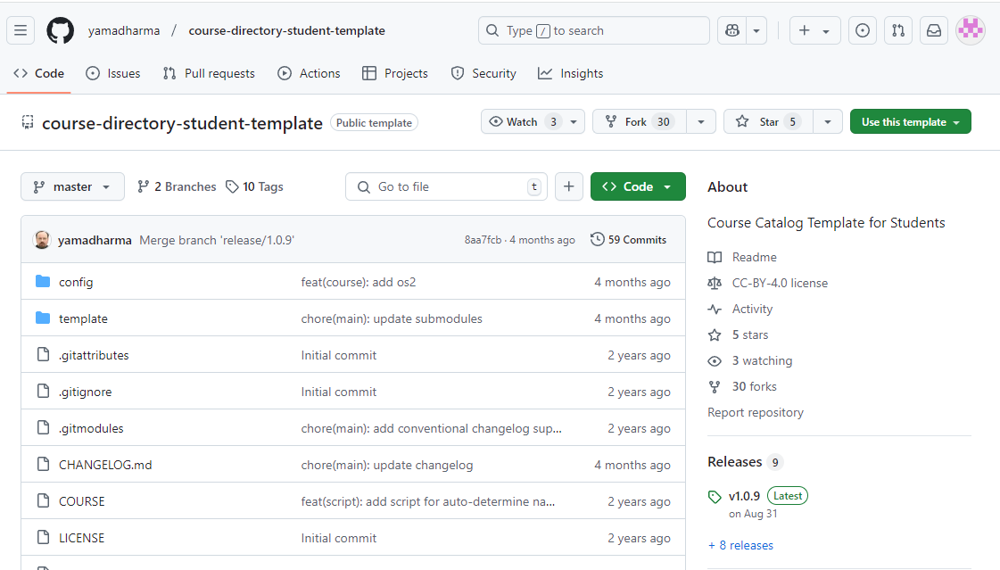
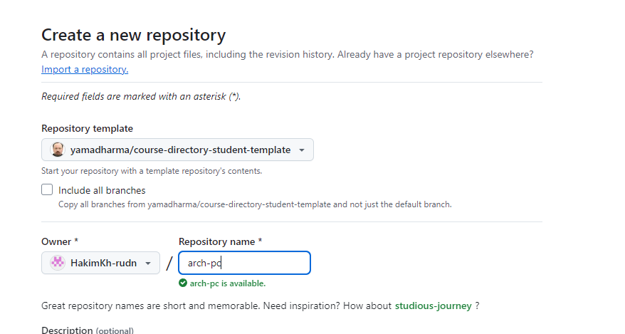
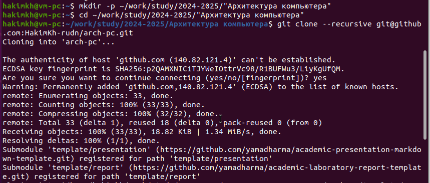
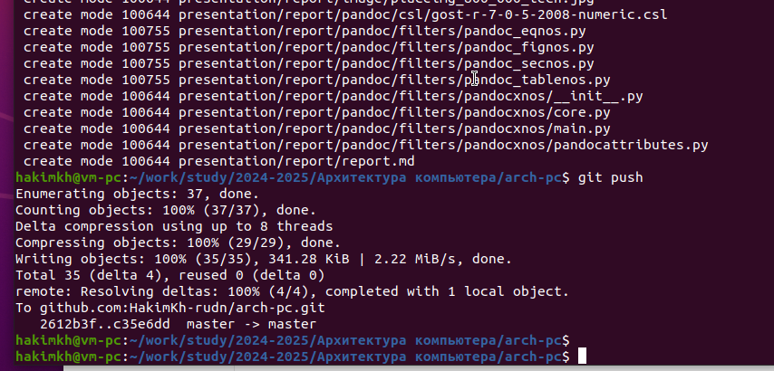
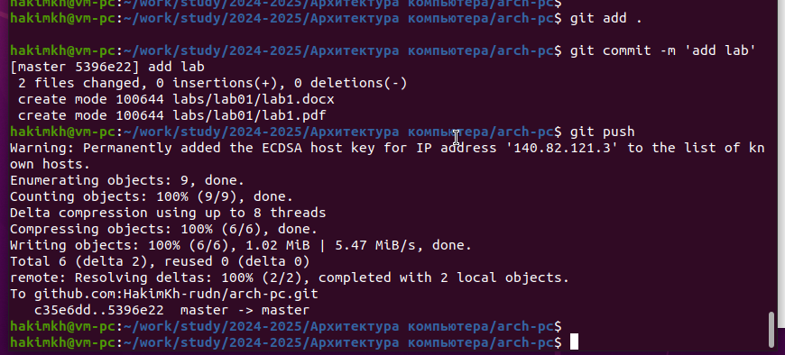
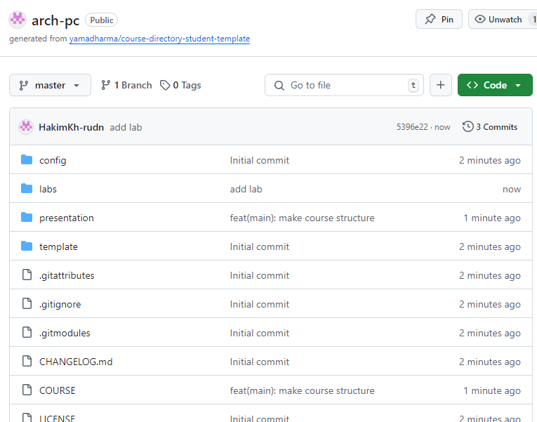

---
## Front matter
title: "Отчёт по лабораторной работе 2"
subtitle: "Архитектура компьютеров"
author: "Хзиба Хаким НПИбд-02-24"

## Generic otions
lang: ru-RU
toc-title: "Содержание"

## Bibliography
bibliography: bib/cite.bib
csl: pandoc/csl/gost-r-7-0-5-2008-numeric.csl

## Pdf output format
toc: true # Table of contents
toc-depth: 2
lof: true # List of figures
lot: true # List of tables
fontsize: 12pt
linestretch: 1.5
papersize: a4
documentclass: scrreprt
## I18n polyglossia
polyglossia-lang:
  name: russian
  options:
	- spelling=modern
	- babelshorthands=true
polyglossia-otherlangs:
  name: english
## I18n babel
babel-lang: russian
babel-otherlangs: english
## Fonts
mainfont: PT Serif
romanfont: PT Serif
sansfont: PT Sans
monofont: PT Mono
mainfontoptions: Ligatures=TeX
romanfontoptions: Ligatures=TeX
sansfontoptions: Ligatures=TeX,Scale=MatchLowercase
monofontoptions: Scale=MatchLowercase,Scale=0.9
## Biblatex
biblatex: true
biblio-style: "gost-numeric"
biblatexoptions:
  - parentracker=true
  - backend=biber
  - hyperref=auto
  - language=auto
  - autolang=other*
  - citestyle=gost-numeric
## Pandoc-crossref LaTeX customization
figureTitle: "Рис."
tableTitle: "Таблица"
listingTitle: "Листинг"
lofTitle: "Список иллюстраций"
lotTitle: "Список таблиц"
lolTitle: "Листинги"
## Misc options
indent: true
header-includes:
  - \usepackage{indentfirst}
  - \usepackage{float} # keep figures where there are in the text
  - \floatplacement{figure}{H} # keep figures where there are in the text
---

# Цель работы

Целью работы является изучить идеологию и применение средств контроля версий. Приобрести практические навыки по работе с системой git.

# Выполнение лабораторной работы

## Настройка github

Сначала настраиваю Git на своем компьютере. Создаю пользователя в системе Git и указываю параметры — имя и email, 
чтобы мои действия были правильно подписаны. (рис. [-@fig:001])

{ #fig:001 width=70%, height=70% }

Генерирую SSH-ключи, которые нужны для идентификации на GitHub. (рис. [-@fig:002]) 
Сохраняю их на компьютере и добавляю публичный 
ключ в свой профиль на GitHub для установления связи. (рис. [-@fig:003])

{ #fig:002 width=70%, height=70% }

{ #fig:003 width=70%, height=70% }

## Сознание репозитория курса на основе шаблона

Нахожу нужный репозиторий-шаблон (рис. [-@fig:004]) 
и делаю из него копию для работы (рис. [-@fig:005]).

{ #fig:004 width=70%, height=70% }

{ #fig:005 width=70%, height=70% }

## Настройка каталога курса

Создаю рабочую директорию на своем компьютере для хранения файлов проекта. Клонирую репозиторий с 
GitHub в эту директорию, чтобы работать с файлами локально. (рис. [-@fig:006]) (рис. [-@fig:007]) 

{ #fig:006 width=70%, height=70% }

{ #fig:007 width=70%, height=70% }

После подготовки структуры добавляю изменения в локальный репозиторий и отправляю их на 
GitHub командой push. (рис. [-@fig:008])

{ #fig:008 width=70%, height=70% }

## Задание для самостоятельной работы

Загружаю отчёты по выполненным работам в соответствующие папки на GitHub, 
обновляя репозиторий по мере необходимости. (рис. [-@fig:009]) (рис. [-@fig:010])

{ #fig:009 width=70%, height=70% }

{ #fig:010 width=70%, height=70% }

# Выводы

В ходе выполнения работы изучили работу с GitHub.